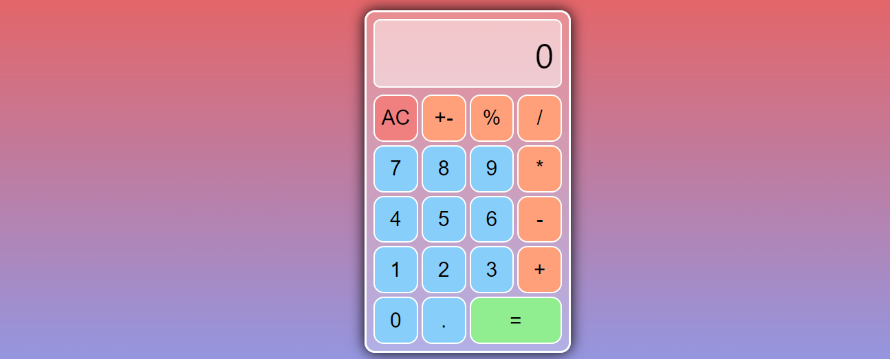

# Math magicians: components

> Using React, UI of the calculator project is created. 

Additional description about the project and its features.

## Built With

- HTML, CSS, REACT
- Visual Studio

## Live Demo

[Live Demo Link](https://medini-rajendra.github.io/mathMagician/)

## Authors

👤 **Rajendra Medini**

- GitHub: [@githubhandle](https://github.com/Medini-Rajendra)
- Twitter: [@twitterhandle](https://twitter.com/invenire512)
- LinkedIn: [LinkedIn](https://www.linkedin.com/in/medinichaitanya/)

## 📝 License

This project is [MIT](./MIT.md) licensed.
=======
# Getting Started with Create React App

This project was bootstrapped with [Create React App](https://github.com/facebook/create-react-app).

## Available Scripts

## Getting Started

To get a local copy up and running follow these simple example steps.

1) Clone the repository to your local machine (git clone https://github.com/Medini-Rajendra/mathMagician.git)
2) change directory to mathMagician (cd mathMagician)

In the project directory, you can run:

### `npm start`

Runs the app in the development mode.\
Open [http://localhost:3000](http://localhost:3000) to view it in the browser.
